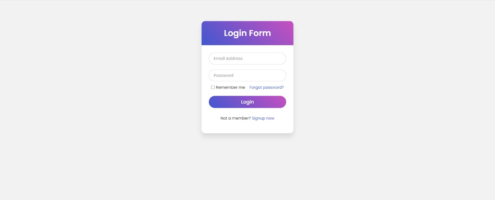
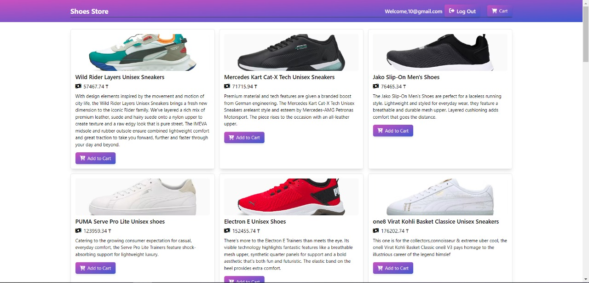
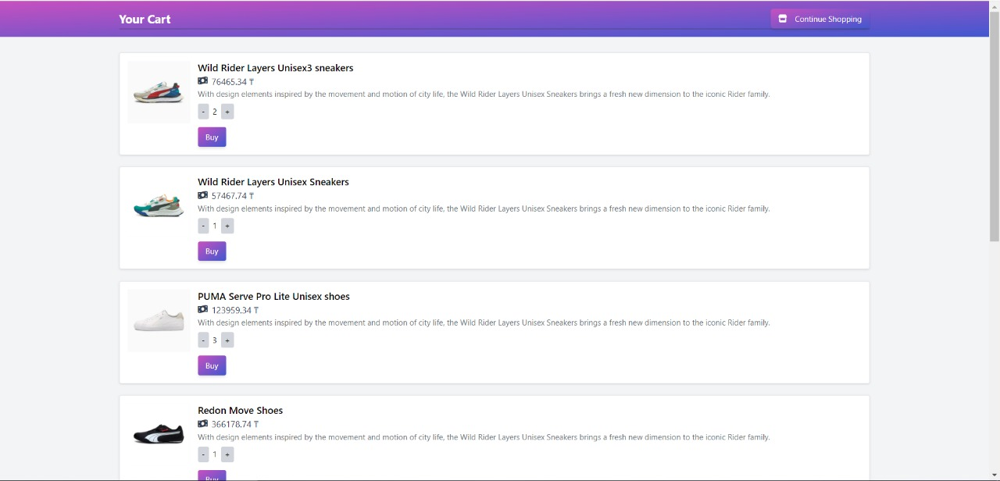
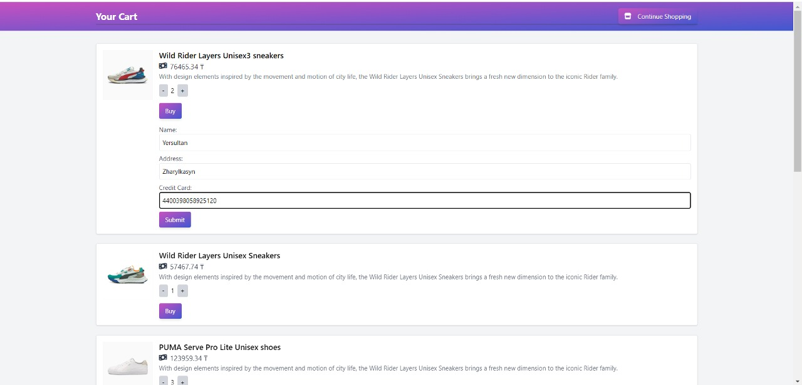

# Shoes Store Project


## Screenshots

### Login


### Homepage


### Product Page


### Form Page


## About the Project

This Shoes Store project is a web application designed to showcase and manage a collection of shoes. It allows users to browse products, view their details, and add them to their cart. The cart functionality includes adding and updating quantities of items, and a purchase process is provided for checkout.

The application leverages a combination of technologies and tools:
- **Express**: For creating the server and handling routing.
- **MongoDB Atlas**: For managing user sessions and storing product data.
- **EJS**: For rendering HTML pages (though the project prefers using HTML files directly).
- **Tailwind CSS**: For styling the frontend.
- **Font Awesome**: For icons.

## API Integration

The project fetches product data from a third-party API. Here’s a summary of the API integration:

### Shoes Collection API

- **Endpoint**: `https://shoes-collections.p.rapidapi.com/shoes`
- **Headers**:
  - `x-rapidapi-key`: Your RapidAPI key.
  - `x-rapidapi-host`: `shoes-collections.p.rapidapi.com`

Make sure to replace `YOUR_RAPIDAPI_KEY` with your actual RapidAPI key.

## Getting Started

To set up and run the project locally, follow these steps:

### Prerequisites

- **Node.js**: Ensure you have Node.js installed on your system. You can download it from [nodejs.org](https://nodejs.org/).
- **MongoDB Atlas Account**: Set up a MongoDB Atlas account and create a cluster. Obtain the connection string for your database.

### Installation

1. **Clone the Repository**

   ```cmd
   git clone <repository-url>
   cd <project-directory>
2. **Install Dependencies**

   ```cmd
   npm install
3. **Environment Variables**  

   Create a `.env` file in the root directory of the project. Add the following environment variables:

   ```env
   PORT=3000
   MONGODB_URI=<your-mongodb-uri>
   RAPIDAPI_KEY=<your-rapidapi-key>
    ```
4. **Build the Project**

   ```cmd
   npm run build:css
   ```  
5. **Run the project**

   ```cmd
   npm run dev

   ```

   
6.**Populate Products**

   ```cmd
   node populateProducts.js
   

   ```

7. **Access the Application**

   Open your browser and visit `http://localhost:3000` to access the Shoes Store application.

## License

Distributed under the MIT License. See `LICENSE` for more information.